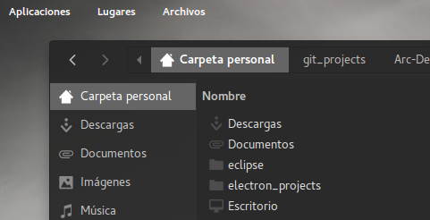
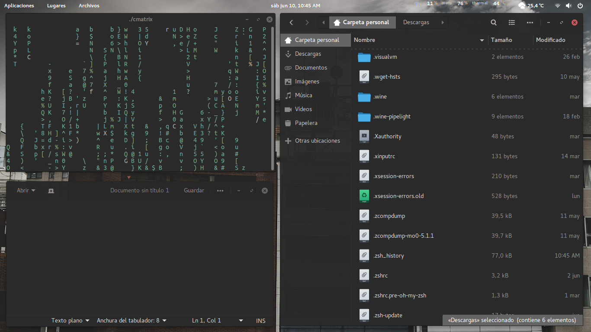

# Arc Deep Dark Theme

Arc Deep Dark is a flat theme with transparent elements for GTK 3 and Gnome-Shell which supports GTK 3 based desktop environments like Gnome.

### Download the built theme
You can find  the version tested in GTK 3 with Gnome 3.20 [here](https://github.com/argorar/Arc-Deep-Dark/releases)

### Why Deep Dark?
For me a deep dark color is more elegant and aesthetic, can be a perfect complement to the type comfy desktops. For some it may not seem like a big change but it makes the difference.

##### Arc Dark Grey [Before]

##### Arc Deep Dark [After]

### Requirements

* Gnome/GTK 3.14, 3.16, 3.18, 3.20 or 3.22
* The `gnome-themes-standard` package
* The murrine engine. This has different names depending on your distro.
  * `gtk-engine-murrine` (Arch Linux)
  * `gtk2-engines-murrine` (Debian, Ubuntu, elementary OS)
  * `gtk-murrine-engine` (Fedora)
  * `gtk2-engine-murrine` (openSUSE)
  * `gtk-engines-murrine` (Gentoo)

Main distributions that meet these requirements are

* Arch Linux and Arch Linux based distros
* Ubuntu 15.04, 15.10 and 16.04 (**Ubuntu 14.04 and 14.10 are not supported**)
* elementary OS Freya
* Debian 8, Testing or Unstable
* Gentoo
* Fedora 21 - 24
* openSUSE 13.2, Leap 42.1 and Tumbleweed

Derivatives of these distributions should work, as well.

If your distribution isn't listed, please check the requirements yourself.

### Installation

**Important:** Remove all older versions of the theme from your system before you proceed any further.

    sudo rm -rf /usr/share/themes/{Arc-Grey,Arc-Darker-Grey,Arc-Dark-Grey}
    rm -rf ~/.local/share/themes/{Arc-Grey,Arc-Darker-Grey,Arc-Dark-Grey}
    rm -rf ~/.themes/{Arc-Grey,Arc-Darker-Grey,Arc-Dark-Grey}

#### Manual Installation

To build the theme you'll need
* `autoconf`
* `automake`
* `pkg-config` or `pkgconfig` if you use Fedora
* `libgtk-3-dev` for Debian based distros or `gtk3-devel` for RPM based distros
* `git` if you want to clone the source directory

If your distributions doesn't ship separate development packages you just need GTK 3 instead of the `-dev` packages.

Install the theme with the following commands

**1. Get the source**

If you want to install the latest version from git, clone the repository with

    git clone https://github.com/argorar/Arc-Deep-Dark --depth 1 && cd arc-grey-theme

**2. Build and install the theme**

    ./autogen.sh --prefix=/usr
    sudo make install

Other options to pass to autogen.sh are

    --disable-transparency     disable transparency in the GTK3 theme
    --disable-light            disable Arc Light support
    --disable-darker           disable Arc Darker support
    --disable-dark             disable Arc Dark support
    --disable-cinnamon         disable Cinnamon support
    --disable-gnome-shell      disable GNOME Shell support
    --disable-gtk2             disable GTK2 support
    --disable-gtk3             disable GTK3 support
    --disable-metacity         disable Metacity support
    --disable-unity            disable Unity support
    --disable-xfwm             disable XFWM support
    --with-gnome=<version>     build the theme for a specific Gnome version (3.14, 3.16, 3.18, 3.20)
                               Note: Normally the correct version is detected automatically and this
                               option should not be needed.

After the installation is complete you can activate the theme with `gnome-tweak-tool` or a similar program by selecting `Arc-Grey`, `Arc-Grey-Darker` or `Arc-Grey-Dark` as Window/GTK+ theme and `Arc-Grey` or `Arc-Grey-Dark` as Gnome-Shell and Xfce-Notify theme.

**Uninstall the theme**

Run

    sudo make uninstall

from the same directory as this README resides in, or

    sudo rm -rf /usr/share/themes/{Arc-Grey,Arc-Darker-Grey,Arc-Dark-Grey}

### Extras

#### Chrome/Chromium theme
To install the Chrome/Chromium theme go to the `extra/Chrome` folder and drag and drop the arc-theme.crx or arc-dark-theme.crx file into the Chrome/Chromium window. The source of the Chrome themes is located in the source "Chrome/arc-theme" folder.

#### Plank theme
To install the Plank theme, copy the `extra/Arc-Plank` folder to `~/.local/share/plank/themes` or to `/usr/share/plank/themes` for system-wide use.
Now open the Plank preferences window by executing `plank --preferences` from a terminal and select `Arc-Plank` as the theme.

### Troubleshooting

If you have Ubuntu with a newer GTK/Gnome version than the one included by default (i.e Ubuntu 14.04 with GTK 3.14 or Ubuntu 15.04 with GTK 3.16, etc.) the prebuilt packages won't work properly and you have to install the theme manually as described above.
This is also true for other distros with a different GTK/Gnome version than the one included by default

### Bugs
If you find a bug you can [open a ticket](https://github.com/argorar/Arc-Deep-Dark/issues)

### Full Preview

Screenshot Details: [Wallpaper](img/wall.jpg) 
